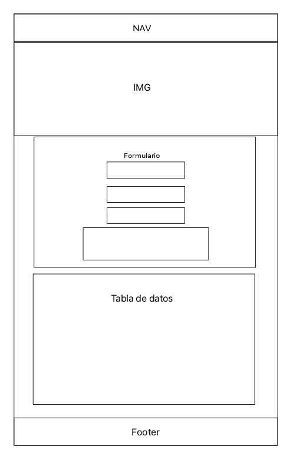

# Proyecto 2

## CRUD HTML y JS

### Descripción

EL proyecto consiste en la creación de un CRUD utilizando HTML JS y estilizarlo en CSS o algún Framework, en mi caso utilicé Bootstrap.

En este CRUD, los datos los rescataremos utilizando JS desde un formulario que se visualiza en un modal y almacenaremos la información en localStorage del navegador, el cual podrá ser visualizado en una tabla, que se crea a partir de Javascript.

## Wireframes

El modelo utilizado es el siguiente:

Cabe mencionar, que el codigo se puede seguir mejorando.
