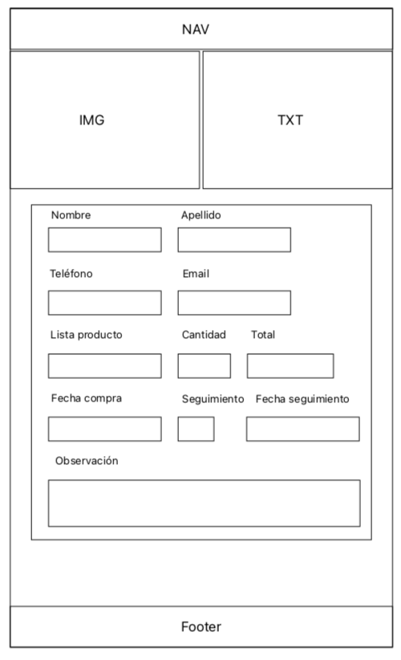

# Proyecto 2

## CRUD HTML y JS

### Descripción

EL proyecto consiste en la creación de un CRUD utilizando HTML JS y estilizarlo en CSS o algún Framework.

En este CRUD, los datos los rescataremos utilizando JS y almacenaremos la información en localStorage del navegador, el cual podrá ser visualizado en una tabla.

En este proyecto, decidí utilizar el conocimiento adquirido en clases anteriores, como "const - let - events - function - if - for" Como resultado no se obtiene una mayor optimización en el código, ya que este es muy extenso, pero cumple la función esperada.

## Wireframes

